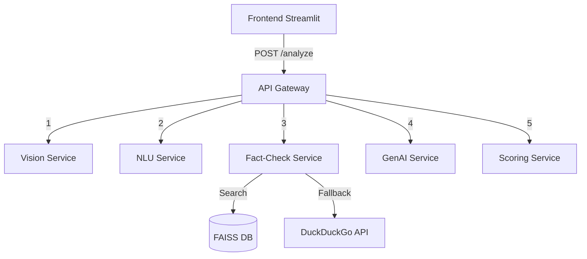

# FactStream

FactStream is a real-time multimodal argument analyzer designed to process video or live webcam feeds along with speech transcripts. It detects logical fallacies, analyzes speaker emotion and body language, fact-checks claims using a RAG pipeline, generates counter-arguments, and evaluates overall credibility.

## Architecture



## Tech Stack
| Component | Technology |
|---|---|
| NLU | PyTorch, HuggingFace BERT |
| Vision | YOLOv8, OpenCV |
| Fact-Check | sentence-transformers, FAISS, NLI |
| GenAI | Llama.cpp, Mistral-7B GGUF |
| Scoring | Pandas, NumPy, SciPy, Matplotlib |
| Backend API | FastAPI, Uvicorn |
| UI | Streamlit |
| DevOps | Docker Compose, Kubernetes, GitHub Actions |

## Deployment Instructions

### Local Setup (Docker Compose)
1. Ensure Docker Desktop is running.
2. Build and start all microservices:
   ```bash
   docker-compose up --build -d
   ```
3. Access the Streamlit dashboard at `http://localhost:8501`

### Kubernetes Setup (Minikube)
1. Start Minikube: `minikube start --driver=docker`
2. Enable Ingress: `minikube addons enable ingress`
3. Build images directly into Minikube's Docker daemon:
   ```bash
   eval $(minikube docker-env)
   docker build -t visualdebate-gateway:latest ./services/gateway
   docker build -t visualdebate-frontend:latest ./frontend
   docker build -t visualdebate-nlu:latest ./services/nlu_service
   docker build -t visualdebate-scoring:latest ./services/scoring_service
   ```
4. Apply the Kubernetes manifests:
   ```bash
   kubectl apply -f kubernetes/
   ```
5. Map the IP address: Add `$(minikube ip) visualdebate.local` to your `/etc/hosts` file.
6. Access the application at `http://visualdebate.local`


## License
MIT
